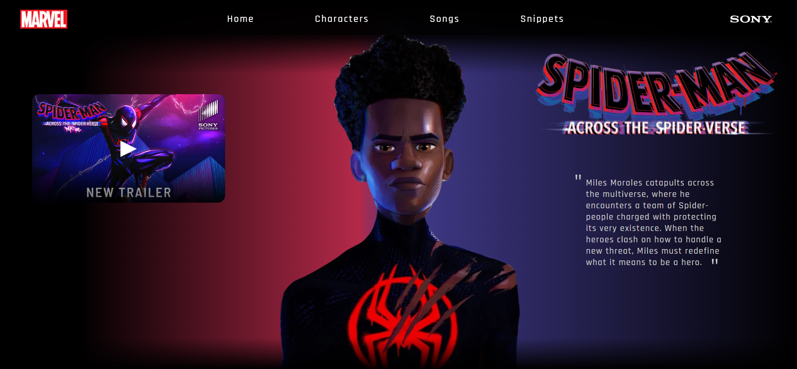
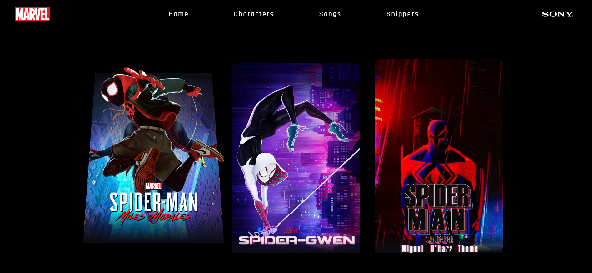
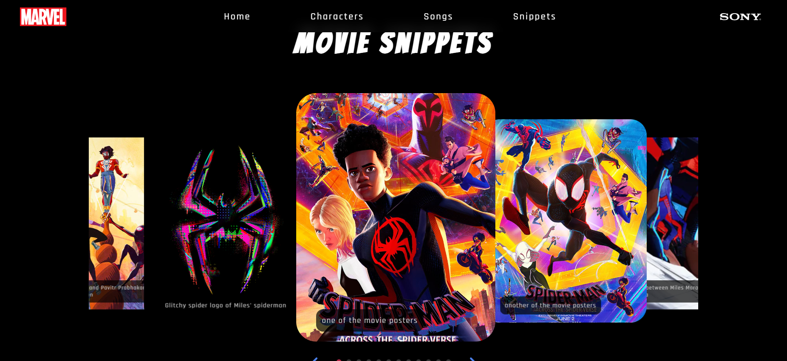

# spiderman-tribute-website
A tribute website for the movie "Spiderman: Across the SpiderVerse"

## Project Images

## Design Inspiration:
- follows the overall theme of the movie
- home section design taken from a pinterest post
- character section design inspired by a code pen

## Technologies Used:
- HTML
- CSS
- JavaScript (for video toggle + Swiper.js for the snippets section)
- A lot of image editing for the assets used

## How to Run:
1. open the live demo link [<insert link>]
2. that's it!!